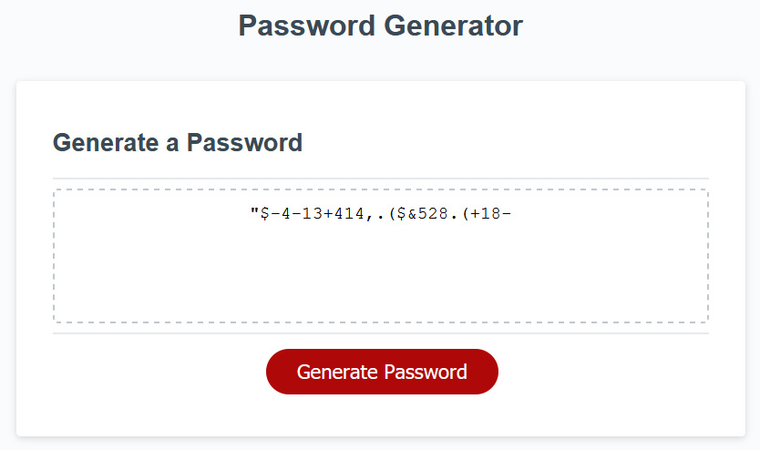

# Password Generator
  

## Description

This is an online password generator which creates a password based on user input options. The user can select a password length, ranging from 8 to 128 characters, and can choose to include any of the four types of characters. These include:

* lower case
* upper case
* numerical
* special (!, ", $, %, &, etc.) 

Once all of the options are selected, a randomly generated password is created by selecting the "Generate Password" button and displayed on the page.

The password generator can be seen at: https://yooperjb.github.io/password_generator/

---

## Usage

To use simply download code to your webserver. Anyone is free to use as they wish. Please contact me if doing so. 

